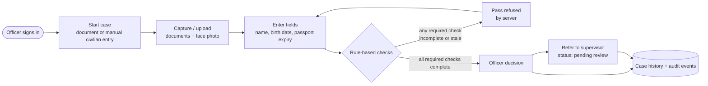

<div align="center">


<defs>
  <linearGradient id="bg" x1="0" y1="0" x2="1" y2="1"><stop offset="0" stop-color="#070b1a"/><stop offset="0.55" stop-color="#101445"/><stop offset="1" stop-color="#1b0f45"/></linearGradient>
  <linearGradient id="ttl" x1="0" y1="0" x2="1" y2="0"><stop offset="0" stop-color="#ffffff"/><stop offset="1" stop-color="#67e8f9"/></linearGradient>
  <radialGradient id="glow" cx="0.5" cy="0.5" r="0.5"><stop offset="0" stop-color="#22d3ee" stop-opacity="0.35"/><stop offset="1" stop-color="#22d3ee" stop-opacity="0"/></radialGradient>
  <pattern id="grid" width="40" height="40" patternUnits="userSpaceOnUse"><path d="M40 0H0V40" fill="none" stroke="#ffffff" stroke-opacity="0.045"/></pattern>
  <style>
    @keyframes floaty { 0%,100% { transform: translateY(0px); } 50% { transform: translateY(-7px); } }
    @keyframes pulse { 0% { r: 8; opacity: .9; } 100% { r: 34; opacity: 0; } }
    @keyframes blink { 0%,100% { opacity: .55; } 50% { opacity: 1; } }
    .f1 { animation: floaty 4.2s ease-in-out infinite; }
    .f2 { animation: floaty 5.4s ease-in-out infinite .8s; }
    .f3 { animation: floaty 3.6s ease-in-out infinite 1.6s; }
    .ring { animation: pulse 2.6s ease-out infinite; }
    .dot { animation: blink 2.6s ease-in-out infinite; }
    text { font-family: 'Segoe UI', 'Helvetica Neue', Arial, sans-serif; }
  </style>
</defs>
<rect width="1200" height="340" rx="18" fill="url(#bg)"/>
<rect width="1200" height="340" rx="18" fill="url(#grid)"/>
<ellipse cx="930" cy="232" rx="330" ry="140" fill="url(#glow)"/>

<g ><polygon points="774.1,252.0 930.0,342.0 930.0,329.4 774.1,239.4" fill="#151e48" stroke="rgba(103,232,249,0.25)" stroke-width="1"/><polygon points="1085.9,252.0 930.0,342.0 930.0,329.4 1085.9,239.4" fill="#0e1533" stroke="rgba(103,232,249,0.25)" stroke-width="1"/><polygon points="930.0,149.4 1085.9,239.4 930.0,329.4 774.1,239.4" fill="#1f2b63" stroke="rgba(103,232,249,0.25)" stroke-width="1"/></g>
<g class="f1"><polygon points="898.8,185.4 930.0,203.4 930.0,160.2 898.8,142.2" fill="#8b6fe8" stroke="rgba(255,255,255,0.10)" stroke-width="1"/><polygon points="961.2,185.4 930.0,203.4 930.0,160.2 961.2,142.2" fill="#5b43a8" stroke="rgba(255,255,255,0.10)" stroke-width="1"/><polygon points="930.0,124.2 961.2,142.2 930.0,160.2 898.8,142.2" fill="#c4b5fd" stroke="rgba(255,255,255,0.10)" stroke-width="1"/></g>
<g class="f2"><polygon points="845.8,216.0 877.0,234.0 877.0,205.2 845.8,187.2" fill="#e0a020" stroke="rgba(255,255,255,0.10)" stroke-width="1"/><polygon points="908.2,216.0 877.0,234.0 877.0,205.2 908.2,187.2" fill="#a3700f" stroke="rgba(255,255,255,0.10)" stroke-width="1"/><polygon points="877.0,169.2 908.2,187.2 877.0,205.2 845.8,187.2" fill="#fcd34d" stroke="rgba(255,255,255,0.10)" stroke-width="1"/></g>
<g class="f2"><polygon points="951.8,216.0 983.0,234.0 983.0,147.6 951.8,129.6" fill="#1aa6c4" stroke="rgba(255,255,255,0.10)" stroke-width="1"/><polygon points="1014.2,216.0 983.0,234.0 983.0,147.6 1014.2,129.6" fill="#0e7490" stroke="rgba(255,255,255,0.10)" stroke-width="1"/><polygon points="983.0,111.6 1014.2,129.6 983.0,147.6 951.8,129.6" fill="#67e8f9" stroke="rgba(255,255,255,0.10)" stroke-width="1"/></g>
<g class="f3"><polygon points="995.5,244.8 1023.5,261.0 1023.5,228.6 995.5,212.4" fill="#25b283" stroke="rgba(255,255,255,0.10)" stroke-width="1"/><polygon points="1051.6,244.8 1023.5,261.0 1023.5,228.6 1051.6,212.4" fill="#0f7a5a" stroke="rgba(255,255,255,0.10)" stroke-width="1"/><polygon points="1023.5,196.2 1051.6,212.4 1023.5,228.6 995.5,212.4" fill="#6ee7b7" stroke="rgba(255,255,255,0.10)" stroke-width="1"/></g>
<g class="f1"><polygon points="802.2,244.8 833.4,262.8 833.4,198.0 802.2,180.0" fill="#25b283" stroke="rgba(255,255,255,0.10)" stroke-width="1"/><polygon points="864.5,244.8 833.4,262.8 833.4,198.0 864.5,180.0" fill="#0f7a5a" stroke="rgba(255,255,255,0.10)" stroke-width="1"/><polygon points="833.4,162.0 864.5,180.0 833.4,198.0 802.2,180.0" fill="#6ee7b7" stroke="rgba(255,255,255,0.10)" stroke-width="1"/></g>
<g class="f1"><polygon points="889.5,244.8 930.0,268.2 930.0,149.4 889.5,126.0" fill="#1aa6c4" stroke="rgba(255,255,255,0.10)" stroke-width="1"/><polygon points="970.5,244.8 930.0,268.2 930.0,149.4 970.5,126.0" fill="#0e7490" stroke="rgba(255,255,255,0.10)" stroke-width="1"/><polygon points="930.0,102.6 970.5,126.0 930.0,149.4 889.5,126.0" fill="#67e8f9" stroke="rgba(255,255,255,0.10)" stroke-width="1"/></g>
<g class="f3"><polygon points="852.1,277.2 883.2,295.2 883.2,259.2 852.1,241.2" fill="#8b6fe8" stroke="rgba(255,255,255,0.10)" stroke-width="1"/><polygon points="914.4,277.2 883.2,295.2 883.2,259.2 914.4,241.2" fill="#5b43a8" stroke="rgba(255,255,255,0.10)" stroke-width="1"/><polygon points="883.2,223.2 914.4,241.2 883.2,259.2 852.1,241.2" fill="#c4b5fd" stroke="rgba(255,255,255,0.10)" stroke-width="1"/></g>
<g class="f3"><polygon points="939.4,277.2 970.5,295.2 970.5,237.6 939.4,219.6" fill="#d9569a" stroke="rgba(255,255,255,0.10)" stroke-width="1"/><polygon points="1001.7,277.2 970.5,295.2 970.5,237.6 1001.7,219.6" fill="#9d2f6f" stroke="rgba(255,255,255,0.10)" stroke-width="1"/><polygon points="970.5,201.6 1001.7,219.6 970.5,237.6 939.4,219.6" fill="#f9a8d4" stroke="rgba(255,255,255,0.10)" stroke-width="1"/></g>
<g class="f2"><polygon points="901.9,302.4 930.0,318.6 930.0,239.4 901.9,223.2" fill="#e0a020" stroke="rgba(255,255,255,0.10)" stroke-width="1"/><polygon points="958.1,302.4 930.0,318.6 930.0,239.4 958.1,223.2" fill="#a3700f" stroke="rgba(255,255,255,0.10)" stroke-width="1"/><polygon points="930.0,207.0 958.1,223.2 930.0,239.4 901.9,223.2" fill="#fcd34d" stroke="rgba(255,255,255,0.10)" stroke-width="1"/></g>
<g class="f1">
  <ellipse cx="930.0" cy="126.0" rx="26" ry="13" fill="#062a36" stroke="#ecfeff" stroke-width="2"/>
  <ellipse class="dot" cx="930.0" cy="126.0" rx="10" ry="5" fill="#22d3ee"/>
  <circle cx="930.0" cy="126.0" r="8" fill="none" stroke="#67e8f9" stroke-width="2" class="ring" style="transform-origin:930.0px 126.0px"/>
</g>

<text x="60" y="128" font-size="20" font-weight="600" fill="#67e8f9" letter-spacing="4">SMART INDIA HACKATHON 2026</text>
<text x="58" y="200" font-size="70" font-weight="800" fill="url(#ttl)">SeemaDrishti</text>
<text x="60" y="242" font-size="22" fill="#c7d2fe">SSB screening prototype · Officer workspace</text>

<rect x="60" y="266" width="168" height="32" rx="16" fill="rgba(103,232,249,0.10)" stroke="rgba(103,232,249,0.45)"/><text x="144" y="287" font-size="14" fill="#e0f2fe" text-anchor="middle">Document capture</text>
<rect x="240" y="266" width="133" height="32" rx="16" fill="rgba(103,232,249,0.10)" stroke="rgba(103,232,249,0.45)"/><text x="306" y="287" font-size="14" fill="#e0f2fe" text-anchor="middle">Face capture</text>
<rect x="385" y="266" width="176" height="32" rx="16" fill="rgba(103,232,249,0.10)" stroke="rgba(103,232,249,0.45)"/><text x="473" y="287" font-size="14" fill="#e0f2fe" text-anchor="middle">Rule-based checks</text>
<rect x="573" y="266" width="193" height="32" rx="16" fill="rgba(103,232,249,0.10)" stroke="rgba(103,232,249,0.45)"/><text x="670" y="287" font-size="14" fill="#e0f2fe" text-anchor="middle">Supervisor referral</text>
</svg>banner.svg…]()


<br/>


**A secure officer workspace for SSB screening: capture documents, run rule-based checks, review, refer, and keep a full audit trail.**

[Try the demo](#-try-it-in-60-seconds) · [Architecture](#-architecture) · [Getting started](#-getting-started) · [Security](#-security-and-access-model) · [Limitations](#-known-limitations)

</div>

> [!IMPORTANT]
> **Prototype notice.** SeemaDrishti is a private prototype built for Smart India Hackathon 2026. Officer profiles are self-entered and are **not** SSB credential verification. A real SSB identity provider must be integrated before any operational deployment.

---

## Table of Contents

- [About](#-about)
- [Try it in 60 seconds](#-try-it-in-60-seconds)
- [Features](#-features)
- [How a case flows](#-how-a-case-flows)
- [Architecture](#-architecture)
- [Checks: what works today](#-checks-what-works-today)
- [Security and access model](#-security-and-access-model)
- [Getting started](#-getting-started)
- [Testing](#-testing)
- [Project structure](#-project-structure)
- [Camera troubleshooting](#-camera-troubleshooting)
- [Known limitations](#-known-limitations)

---

## 🔭 About

**Seema** (सीमा) means *border* and **Drishti** (दृष्टि) means *vision*. SeemaDrishti gives a screening officer one place to open a case, attach evidence, run checks on what was entered, record a decision, and hand off to a supervisor.

Its design rule is honesty about what is and isn't verified:

- Checks that are not connected are reported as `not_performed`, never silently skipped.
- Civilian statements and document transcriptions are always marked **unverified**.
- The server **refuses a "passed" decision** while any required check is incomplete or a stored result is stale.

New officer profiles start with **no sample cases**.

## 🚀 Try it in 60 seconds

| | Public demo | Officer workspace |
|---|---|---|
| **Route** | `/` (entry screen) and `/judge` | `/officer` |
| **Authentication** | None. Never calls an auth provider | Platform-authenticated identity |
| **Data** | Three clearly fictional cases, **in memory only** | Cloudflare D1 (records) and R2 (files) |
| **Persistence** | Reload or **Reset demo** restores samples and discards uploads | Persistent and owner-scoped |
| **Backend calls** | None. Runs entirely in the current browser tab | Full API with ownership enforcement |

**Fastest path for judges:** open `/judge`. No login, no setup, no database.

Or start at `/`, where the officer-login mockup has optional **name**, **officer ID** and **checkpoint** fields. **Enter prototype** works with every field blank. These values only customize the current tab and are **not credentials**. **Exit demo** returns to the entry screen, and **Open demo directly** jumps to `/judge`.

## ✨ Features

- **Account-bound officer profiles** with persistent cases
- **Document workflow:** JPEG, PNG, WebP and PDF, up to **12 MB**
- **Camera capture** through the browser camera API, with selectable video devices
- **Live face capture** (capture only, not proof of liveness)
- **Version-preserving recapture:** re-capturing the same document type keeps earlier versions and replaces the active one
- **Entered-field checks** on names, birth dates and passport expiry
- **Officer actions** and **supervisor referral status**
- **Civilian information records**, stored separately from document fields
- **Case history and audit events**
- **Stale-result protection** on pass decisions

## 🔄 How a case flows



## 🧊 Architecture

<div align="center">

</div>

| Layer | Technology | Where |
|---|---|---|
| **Interface** | Embedded into the Worker output at build time | `dist/workspace.js` |
| **API** | Cloudflare Worker | `server/worker.mjs` |
| **Checks** | Rule engine for currently supported checks | `server/checks.mjs` |
| **Records** | Cloudflare D1, schema and migrations via Drizzle | `db/schema.ts`, `drizzle/` |
| **Files** | Cloudflare R2 (documents and face captures) | bound in `wrangler.jsonc` |

Records are **never** stored in `localStorage`. Old reference-only static files are not exposed by the server.

## ✅ Checks: what works today

| Check | Status |
|---|---|
| File-presence checks | ✅ Implemented |
| Rules on officer-entered names | ✅ Implemented |
| Rules on officer-entered birth dates | ✅ Implemented |
| Rules on officer-entered passport expiry | ✅ Implemented |
| OCR / document text extraction | ⏳ `not_performed` |
| Automated capture-quality assessment | ⏳ `not_performed` |
| Document forensics | ⏳ `not_performed` |
| Face matching | ⏳ `not_performed` |
| Liveness detection | ⏳ `not_performed` |
| External records lookup | ⏳ `not_performed` |

## 🔐 Security and access model

- **Platform identity.** `/officer` uses the hosting platform's authenticated user identity. The app issues an **eight-hour, HttpOnly** officer session bound to it. **Logout** revokes the session, then navigates to platform sign-out.
- **Restricted enrollment.** New officer profiles require an address on the server-only `OFFICER_EMAIL_ALLOWLIST` setting. Existing profiles authenticate normally. Signing in to the hosting platform alone does **not** grant enrollment.
- **Ownership enforced.** File reads and case operations require the owning officer or a server-provisioned supervisor role.
- **No client-side role selector** can grant supervisor access.
- **Public surface is minimal.** The public Site audience exposes only the demo and interface assets. Officer APIs still require an officer session.
- **Local identity is localhost-only.** Never set `LOCAL_DEVELOPMENT=true` on a hosted environment. Hosted deployments rely on platform identity headers.

## 🛠 Getting started

**Requirements:** Node.js **22 or newer** and npm.

### Run the public prototype

```sh
npm ci
npm run build
npm run dev
```

Open <http://localhost:4173>, or go straight to `/judge`. Demo records need no database setup.

### Run the persistent `/officer` workspace locally

1. Apply local D1 migrations:

   ```sh
   npx wrangler d1 migrations apply DB --local
   ```

2. Create an ignored `.dev.vars` file (local preview only). See `.env.example` for the other settings:

   ```
   LOCAL_DEVELOPMENT=true
   ```

   The fallback identity is additionally restricted to localhost hostnames.

3. Start the dev server as above and open `/officer`.

### Generate future schema migrations

```sh
npm run db:generate
```

## 🧪 Testing

```sh
# Field-rule and input checks
npm test

# Integration tests (local server must be running)
node tests/integration.mjs
```

The integration suite covers login, persistence, ownership isolation, upload storage, recapture versioning, stale results, logout, and invalid-pass enforcement. It uses isolated local test accounts and does **not** populate hosted officer records.

## 📁 Project structure

```
.
├── assets/               # README visuals (3D banner, architecture diagram)
├── db/
│   └── schema.ts         # D1 storage schema
├── dist/
│   └── workspace.js      # Interface implementation
├── drizzle/              # Generated migrations
├── scripts/              # Project scripts
├── server/
│   ├── worker.mjs        # API implementation (Cloudflare Worker)
│   └── checks.mjs        # Currently supported checks
├── tests/
│   └── integration.mjs   # End-to-end integration checks
├── .env.example
├── drizzle.config.ts
├── package.json
└── wrangler.jsonc        # Cloudflare Worker configuration
```

## 📷 Camera troubleshooting

Camera access needs **HTTPS**, browser permission, and device permission. The interface tells these failures apart: permission denied, unsupported context, device problems, and device in use.

Built-in recovery:

- Retries unsupported constraints with the default camera
- Stops streams on close and navigation
- Offers an HTML capture / file-picker fallback (`device_camera`), which may return an existing photo

The app **cannot** override a browser or OS camera denial. Re-enable access in your browser or system settings.

## ⚠️ Known limitations

- Officer profile details are self-entered and unverified.
- Uploading a document does **not** extract its text. Civilian statements and transcriptions are entered manually and marked unverified.
- Face-photo capture is **not** proof of liveness.
- Direct scanner drivers are not connected. Import scanner output as a file.
- Supervisor referrals are recorded as *pending review*. No notification service is connected.
- OCR, capture quality, forensics, face matching, liveness and external records checks are not connected (see [Checks](#-checks-what-works-today)).
- The public demo keeps data in memory only and resets on reload.

---

<div align="center">

Built for **Smart India Hackathon 2026** · `ssb-26-rootX`

</div>
